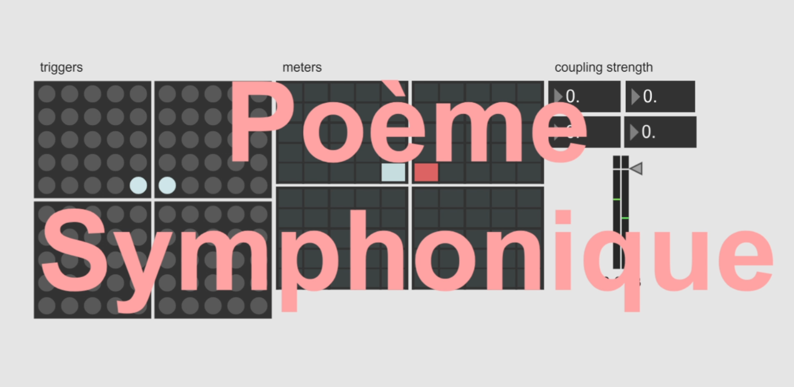

# Software Poème Symphonique

Modernist composer György Ligeti would have been 100 years in 2023. To celebrate, I recreated his famous 'Poème Symphonique for 100 metronomes' as audio software with a realtime ML-based sound engine.

For live demo and more in-depth descripion, visit - https://aleksati.net/posts/exploring-dataset-sonification-with-web-audio

 

